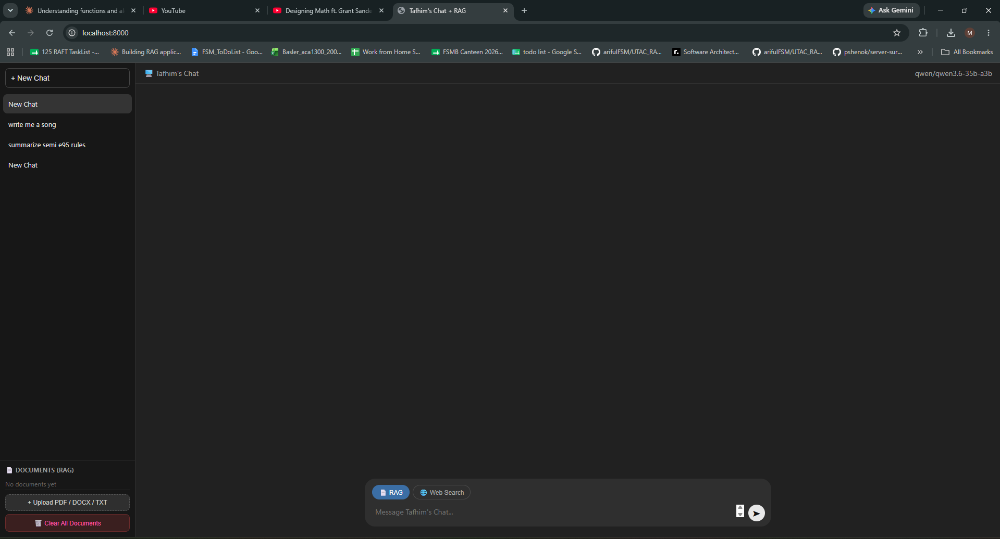
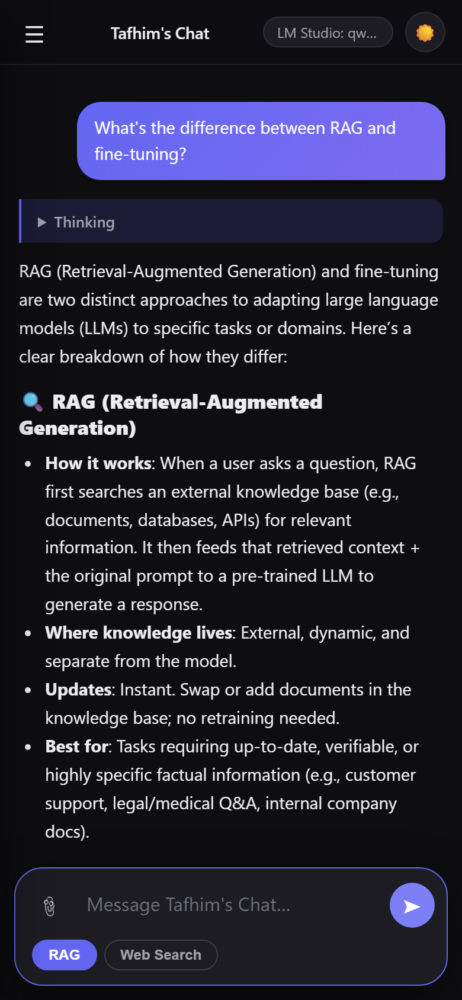

# Local LLM Chatbot with RAG

A local ChatGPT-style web app for Ollama or LM Studio, with document RAG, web search, streaming responses, visible thinking output, and a cancellable generation flow.

## Preview

### Desktop



### Mobile



## Features

- ChatGPT-style chat UI with sidebar conversations and browser-saved history
- Modular frontend split into app, API, store, rendering, markdown, config, and styles
- FastAPI backend with provider adapters for Ollama and LM Studio
- Document RAG for PDF, DOCX, TXT, and Markdown files
- Web search using DuckDuckGo HTML results
- Live streamed model responses
- Live thinking/reasoning display for models/providers that stream reasoning tokens
- Web-search status and result display while a response is generating
- Stop button to cancel an active model response while keeping any partial output
- Markdown rendering, syntax highlighting, and copy buttons for code blocks
- Mobile responsive layout
- One-click vector database/document clear action

## Project Structure

```text
local-llm-chatbot-with-rag/
├── frontend/
│   ├── Dockerfile          # Nginx frontend container
│   ├── index.html          # App shell
│   ├── styles.css          # UI styles
│   └── js/
│       ├── api.js          # Backend calls and SSE parsing
│       ├── app.js          # App orchestration and event wiring
│       ├── config.js       # Frontend configuration
│       ├── markdown.js     # Markdown rendering and code copy buttons
│       ├── render.js       # DOM rendering
│       ├── store.js        # Chat state and localStorage
│       └── utils.js        # Shared frontend helpers
├── backend/
│   ├── Dockerfile          # FastAPI backend container
│   ├── main.py             # Uvicorn entrypoint
│   ├── app/
│   │   ├── config.py       # Provider and RAG settings
│   │   ├── documents.py    # Upload, ingest, ChromaDB retrieval
│   │   ├── routes.py       # API routes and chat stream orchestration
│   │   ├── schemas.py      # Request models
│   │   ├── web_search.py   # DuckDuckGo HTML search
│   │   └── llm/
│   │       ├── base.py
│   │       ├── ollama.py
│   │       └── lmstudio.py
│   ├── requirements.txt
│   ├── config.example      # Optional .env template
│   ├── start.sh            # Linux/macOS backend launcher
│   ├── start.bat           # Windows launcher
│   └── docs/               # Optional local document folder
├── docker-compose.yml
├── assets/img/
├── LICENSE
└── README.md
```

## Requirements

- Python 3.10+
- A modern browser
- Ollama running locally, or LM Studio with an OpenAI-compatible local server
- A chat model
- An embedding model, such as `nomic-embed-text`

The current backend defaults use Ollama at `http://localhost:11434` and:

```bash
OLLAMA_CHAT_MODEL=gemma4:e2b
OLLAMA_EMBED_MODEL=nomic-embed-text
```

## Setup

### 1. Start Ollama

```bash
ollama serve
```

In another terminal, pull the embedding model and your chat model:

```bash
ollama pull nomic-embed-text
ollama pull gemma4:e2b
```

Use any Ollama chat model you prefer if that model is not available on your machine.

### 2. Run the Backend

```bash
cd backend
chmod +x start.sh
./start.sh
```

The backend runs at:

```text
http://localhost:8001
```

### 3. Run the Frontend

The frontend uses ES modules, so serve it over HTTP:

```bash
cd frontend
python -m http.server 8000
```

Open:

```text
http://localhost:8000
```

If port `8000` is busy, use another port:

```bash
python -m http.server 8002
```

### 4. Or: Run with Docker

You can use Docker Compose to run both the frontend and backend together:

```bash
docker compose up -d --build
```

The app will be available at `http://localhost:8000`, and the backend at `http://localhost:8001` (exposed directly via host networking).

## Configuration

For repeated local configuration, copy the example file:

```bash
cd backend
cp config.example .env
```

Then edit `.env` and run `./start.sh`.

Common Ollama settings:

```bash
LLM_PROVIDER=ollama
OLLAMA_BASE=http://localhost:11434
OLLAMA_CHAT_MODEL=your-chat-model
OLLAMA_EMBED_MODEL=nomic-embed-text
```

LM Studio example:

```bash
LLM_PROVIDER=lmstudio
LMSTUDIO_BASE=http://localhost:1234/v1
LMSTUDIO_CHAT_MODEL=your-chat-model
LMSTUDIO_EMBED_MODEL=your-embedding-model
```

RAG settings:

```bash
DOCS_FOLDER=./docs
CHROMA_PATH=./chroma_db
CHUNK_SIZE=800
CHUNK_OVERLAP=150
TOP_K=4
```

Frontend backend URL:

```js
// frontend/js/config.js
export const RAG_BACKEND = "http://localhost:8001";
```

Change this if you open the frontend from another device on your network.

## Using the App

- Type a message and press Enter to send.
- Press Shift+Enter for a new line.
- Use the `RAG` toggle to include uploaded/local documents.
- Use the `Web Search` toggle to search the web before answering.
- Click the stop button while a response is generating to cancel it.
- Thinking output appears above the final answer when the active model/provider streams reasoning tokens.
- Web-search status and results appear before the model answer when web search is enabled.

## Documents and RAG

Upload documents from the sidebar with `+ Upload PDF / DOCX / TXT`, or place files in:

```text
backend/docs/
```

Then call:

```bash
curl -X POST http://localhost:8001/rescan
```

Supported upload extensions:

- `.pdf`
- `.docx`
- `.txt`
- `.md`

To clear documents and the vector database, click `Clear All Documents` in the sidebar or call:

```bash
curl -X POST http://localhost:8001/clear
```

## API Overview

```text
GET  /             Backend status and active provider info
POST /chat         Stream chat response as server-sent events
POST /upload       Upload a document
GET  /documents    List ingested documents
POST /rescan       Scan backend/docs
POST /clear        Clear documents and vector database
```

The chat stream sends OpenAI-compatible content deltas, plus app-level events for:

- `status`
- `sources`
- `web_results`
- `done`

Reasoning/thinking tokens are normalized into `reasoning_content` when supported.

## Notes

- Ollama or LM Studio must stay running while chatting.
- Document ingestion requires an embedding model.
- Visible thinking depends on model/provider support. Some models do not emit reasoning tokens.
- Web search uses DuckDuckGo HTML results, so availability can depend on network access and DuckDuckGo response behavior.
- The frontend stores chat history in browser `localStorage`.

## License

MIT
